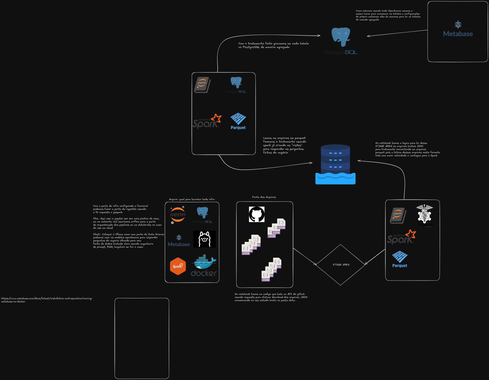

<h2> Desafio Engenheiro de Dados Pleno Minsait </h2>

          

          

          

          
 

## <h4> O que é o projeto? </h4>

* Dado o contexto médico fui desafiado pela empresa Minsait a rascunhar uma arquitetura de dados e analise, fazendo a engenharia de dados resolvendo desde a ingestão do dado via arquivos JSON até sua implementação e usabilidade na camada de visualização deixando livre para consultas SQL.

---

<h4> Como rodar o projeto? </h4>

* Com o arquivo docker-compose.yaml em mãos na pasta do projeto abre um terminal e rode "sudo docker compose up -d" ele vai levantar todos os containers usados no projeto e ao mesmo tempo fazer a rede para que os containers rodem em rede. Verifique com o comando "sudo docker network inspect documentos_app-network" para ver quais IP's cada container pegou depois disso abre o desafio.ipynb no IP atribuido ao container do jupyter aqui no meu pc abri em http://127.0.0.1:8888 se o seu jupyter te pedir algum token rode esse comando "sudo docker logs jupyter" e pegue a url com o token!

---

<h4> TELAS METABASE </h4>

 Na tela é possivel visualizar o resultado no metabase "Condições clinicas mais comuns". 

<ul>

</ul>

##

 

<h4> TELA METABASE </h4>

 Na tela é possivel visualizar o resultado no metabase "Medicamentos mais prescritos". 

<ul>

</ul>

##

 

<h4> TELA METABASE </h4>

 Na tela é possivel visualizar o resultado no metabase "Sexo/Genero" e organizações. 

<ul>

</ul>

##

 

<h4> TELA JUPYTER NOTEBOOK </h4>

 Na tela é possivel visualizar o resultado no metabase "Sexo/Genero" e organizações. 

<ul>

</ul>

##

 

<h4> TELA ARQUITETURA </h4>

 Na tela é possivel visualizar a arquitetura e todas as lib/ferramentas utilizadas no projeto 

<ul>

</ul>

##
